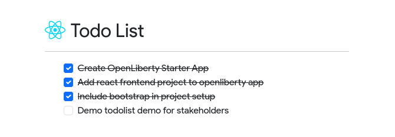

# OpenLiberty + React Demo App

## Setup

1. Clone the repo using `git clone`, and `cd` into the project
2. Run `./mvnw process-resources` to build the frontend into a static site
3. Run `./mvnw liberty:dev` to start the server

## Demo
The tasks shown on the webpage are specified through an openliberty
endpoint specified by `src/main/java/com/demo/rest/TasksResource.java`.
Editing the completed status of one of these tasks, or adding/removing
them will reload openliberty automatically, then refreshing the web page
should show your change live.

> [!NOTE]
> Please don't reference this pattern as a way of storing tasks. I only
> implemented it this way to demo the 'hot reload' functionality of 
> openliberty. In a real app, these tasks would be stored in localStorage,
> or an actual database.